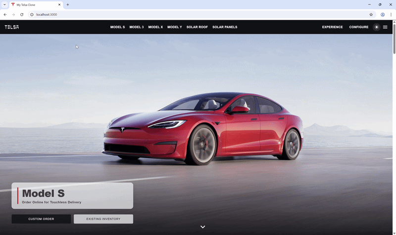

<div align="center">
  
  
  # 🚗 TELSA: The Future of transportation in a superb Web Experience

  **A pixel-perfect, highly animated, and fully responsive clone of the world's most innovative automotive website.**

  [](https://reactjs.org/)
  [](https://redux.js.org/)
  [](https://styled-components.com/)
  
</div>

<br />

> *"Why just build a website when you can build an experience?"*

Welcome to the **TELSA Clone** project! This isn't just a static mockup; it's a dynamic, fully-wired React application designed to replicate the sleek, premium feel of modern automotive e-commerce. From the moment the animated splash screen loads, down to the real-time car configurator and smooth dark mode transitions, every pixel has been crafted with user experience in mind.

---

## ✨ Standout Features

It's all in the details. Here's what makes this clone special:

*   🎬 **Cinematic Splash Screen:** A pulsing, fading logo entry that sets the premium tone right from the start.
*   🌗 **Seamless Dark/Light Mode:** A gorgeous, glassmorphism-powered theme toggle that elegantly transitions the entire app's aesthetic.
*   🏎️ **Real-Time Car Configurator:** Customize your ride! Pick your paint color, swap those wheels, and check out the interior—all while the price updates dynamically.
*   🧭 **Interactive React Routing:** Dedicated, immersive detail pages for every vehicle model (`/model/:modelId`) and the unique `/experience` interior showcase.
*   ✨ **Scroll & Reveal Animations:** Content gracefully slides and fades into view as you explore the page, courtesy of `react-awesome-reveal` and custom CSS keyframes.

---

## 📸 Sneak Peek

*(Hey there! Drop a cool screen-recording GIF of your app here to really show off those sweet animations! Name it `demo.gif` and place it in the root folder).*

<div align="center">
  
</div>

---

## 🛠️ The Tech Engine

Under the hood, this project is powered by modern, reliable, and scalable web technologies:

*   **[React.js](https://reactjs.org/):** The core engine driving our component-based UI.
*   **[Redux Toolkit](https://redux-toolkit.js.org/):** Centralized state management for cars and theme states.
*   **[Styled-Components](https://styled-components.com/):** Component-scoped CSS-in-JS that keeps our styling clean, scalable, and highly dynamic.
*   **[React Router](https://reactrouter.com/):** For seamless, single-page application navigation without the clunky page reloads.
*   **[React Awesome Reveal](https://react-awesome-reveal.morewings.dev/):** Providing smooth, performant scroll animations.

---

## 🚀 Ignition Sequence (Getting Started)

Want to take it for a spin on your local machine? It's easy:

### Prerequisites
Make sure you have [Node.js](https://nodejs.org/) installed.

### Installation

1.  **Clone the repository:**
    ```bash
    git clone https://github.com/G8Supremeo/_telsa_series.git
    cd _telsa_series
    ```

2.  **Install the dependencies:**
    ```bash
    npm install
    # or if you use yarn: yarn install
    ```

3.  **Start the engine:**
    ```bash
    npm start
    ```
    *The app will fire up in development mode. Open [http://localhost:3000](http://localhost:3000) in your browser to start exploring.*

---

## 🤝 Let's Connect!

Built with ⚡️ and ☕ by Supreme.  
If you loved checking out this project, I'd love to connect! Feel free to explore the code, fork it, and let me know what you think.

<div align="center">
  <br />
  
</div>
